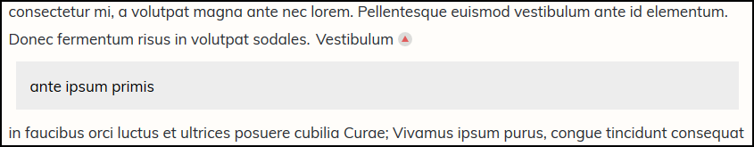

# InfocardJS - easy infocards

**Version:** 1.0
**License:** MIT

InfocardJS allows you to create easy infocards within your main body of content. For the default setting, you type {!text}[text] to get an infocard.
The infocard can be expanded and collapsed by clicking on it.

Infocards help keep visitors on your website, as you can place explainers together with links in a non-intrusive fashion.

The library was written because I wanted a cross-CMS solution to create infocards like these.

## Example
The infocard collapsed:

The infocard expanded:

For a working example, see [this demo](https://www.frisovandijk.com/public/git/infocardjs/demo.html).

## Set-up
Just use infocard.min.js or infocard.js in your project and you're ready to go.

**CSS styling**

There are three classes:
* icard: for the entire infocard
* icard_toggle: the text that's always visible (includes the nested arrow)
* icard_content: the expandable content. It turns into a display:block by defeault.

## Customising
There are several variables to customise at the top of the document:

* regex: Change the pattern used to identify the infocard.
* arrow_style: Change the arrow styling. It supports both size and colour changes.
* divname: Choose which divs need to be scanned for infocards

### Prefixes
The entire package uses icard_ prefixes for its code. If this conflicts with what's in your codebase, just replace those occurences.

## What can't I do?
As far as I know, the only limitation is nesting infocards. Other than that, all HTML code should be accepted.

Oh, and it doesn't work on Internet Explorer.